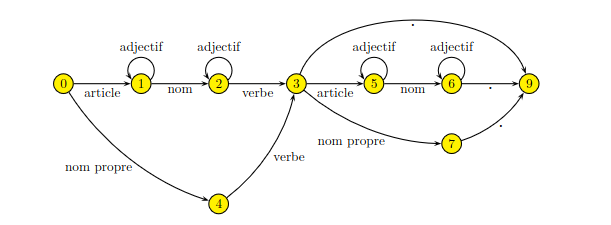

#
## Graphe

### Format d'un graphe

Liste vide = état final

Graph

TABLE DE TRANSITION:
 
-1 = pas de transition (phrase incorrecte)

 9 = phrase correcte
 

| État | 0 article | 1 adjectif | 2 nom | 3 verbe | 4 nom propre | 5 point |
|:----:|:---------:|:----------:|:-----:|:-------:|:------------:|:-------:|
| 0  | 1  | -1 | -1 | -1 | 4  | -1 |
| 1  | -1 | 1  | 2  | -1 | -1 | -1 |
| 2  | -1 | 2  | -1 | 3  | -1 | -1 |
| 3  | 5  | -1 | -1 | -1 | 7  | 9  |
| 4  | -1 | -1 | -1 | 3  | -1 | -1 |
| 5  | -1 | 5  | 6  | -1 | -1 | -1 |
| 6  | -1 | 6  | -1 | -1 | -1 | 9  |
| 7  | -1 | -1 | -1 | -1 | -1 | 9  |
| 8  | -1 | -1 | -1 | -1 | -1 | -1 |
| 9  | -1 | -1 | -1 | -1 | -1 | -1 |

Les exemples testés avec le micro dictionnaire du TP:
le chat mange.      Correct
le joli chat mange. Correct
je mange le chat.   Incorrect
le chad mange.      Incorrect
chat le mange.      Incorrect
Jean dort.          Correct